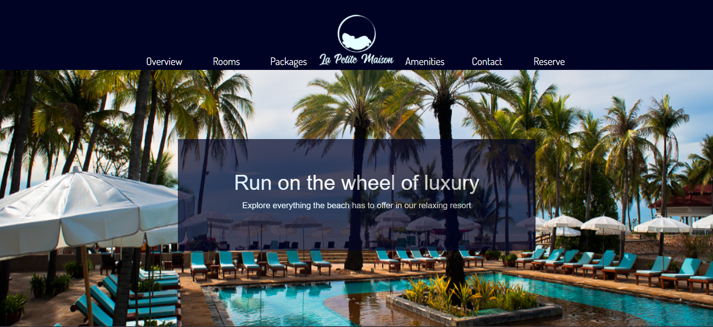

# Hamster Hotel

**Description**: Create a fully functioning website using bootstrap based off a mockup that was provided.

**Name**: Michael Heckerman

**Date**: 10/30/24

**Github**: https://github.com/mkheck13/hamsterhotel2425

**Vercel**: https://hamsterhotel2425.vercel.app/

**Prototype**: https://xd.adobe.com/spec/3e3b745f-aa5a-460e-5fd7-8cc90c248d21-480a/screen/2bce9ed2-c1ed-4a71-ae23-37c1e019d677/

**Notes**: I was struggling with getting my Navbar to do what I wanted it to do. I used Claude AI to figure out my problem. I laid out my problem and how I wanted it to function, I then gave it the sippets of code that were tied to the navbar. It pointed out that my CSS had a height issue and how it could be fixed.

### Peer Review:
**Name**: Alexander Soria

**Comments**: 
Absolutely phenominal website! The design excells beyond the protype with interactivity across the page, from the highlighted navbar buttons to the cards you can hover over. 
Everything looks really nice and pretty here. I really love the static background images as you scroll. With the way they line up, it just feels like you're transitioning smoothly across the page with varying themes, that's really sick!
Super responsive too! Love the way you handled the dropdown menu for the mobile version of the navbar. Not sure if this was intention but your reservations section is missing the main image preseant in the other formats, though this does put more center stage on the input boxes, which is good with how scrunched implementing the photo would be otherwise. 
Also, it appears the text detailing the types of amenities in the hotel are slightly off-center to the right in the mobile version, which was probably the only real glaring issue I found with the site.
Other than that one thing, amazing job!!!

**Update**: I noticed that some of my images still had rounded borders, so I fixed that. Started to change my text size from px to rem. Ken suggested that I move the card hover effects for my room cards to only happen for desktop and not for tablet and mobile. I also took the background-attachment fixed off my hero image, not because of what ken said but because it was having a reaction when scrolling, the image would "catch" and shutter. I adjusted the text in the amenities to be centered when it becomes a list.
